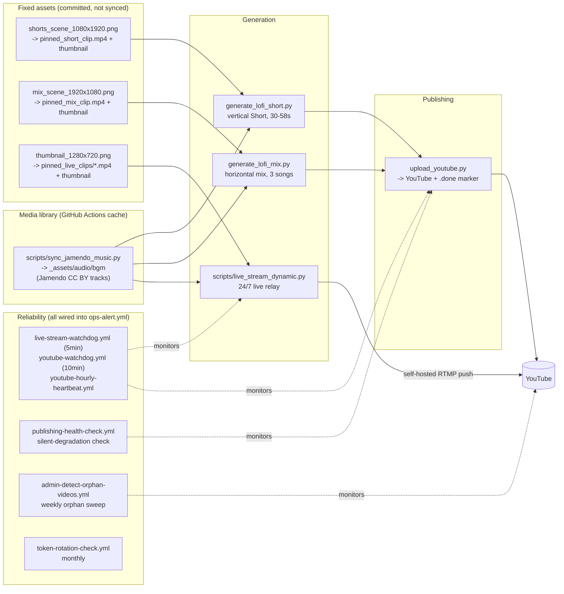

# Amber Hours -- Lofi Beats Bot (YouTube)

Automated pipeline that turns the channel's own branding illustration
and Creative Commons (CC BY, commercial-safe) Jamendo music into looping
lofi YouTube Shorts, a horizontal mix, and a 24/7 lofi live stream -- no
narration, clip + music only -- published through the official YouTube
Data API under the **Amber Hours** brand.

- Cadence: `youtube-bot.yml` (Shorts) publishes every **2 hours**
  (12/day); `lofi-mix-daily.yml` publishes every **3 hours** (8/day).
  Both are deliberately sparse -- YouTube's own account-level upload cap
  (`uploadLimitExceeded`, independent of this repo's own quota guard)
  started rejecting uploads at a much denser cadence (10-minute Shorts +
  30-minute mix). Both use `upload_youtube.py`'s per-canonical-slot
  dedup, so a slot never publishes twice.
- Duration: Shorts are **30-58 seconds**, randomized. The horizontal mix
  is a short **3-song** mix (duration = the sum of the 3 tracks).
- Category: YouTube **Music** (`categoryId=10`) for both formats.
- Content: every format loops one fixed, committed visual
  (`_assets/video/pinned_*`) under Jamendo CC BY-licensed music, with a
  branded title/description -- and each format gets its **own** hand-coded
  illustration (chat, 2026-07-21: an earlier revision reused one shared
  image everywhere, which read as repetitive) so the channel page doesn't
  show the same picture three times over. The pinned clip is itself a
  4-second **animated** loop -- falling rain, twinkling stars, a gentle
  amber-glow pulse, rising mug steam, a spinning record label on the mix --
  not a single static frame repeated for the whole duration (chat,
  2026-07-21 growth pass: a static loop was the single biggest visual gap
  against channels whose backgrounds actually move). Every periodic motion
  is built from an integer number of cycles across the loop so frame 0 and
  the frame after the last one are pixel-identical -- no crossfade needed
  to hide the seam. See `scripts/generate_brand_loops.py` and
  `utils/brand_motion.py`. The upload thumbnail stays a separate static
  PNG (below), unaffected:
  - **Live**: `_assets/branding/thumbnail_1280x720.png` -- night skyline,
    crescent moon, big amber glow, "AMBER HOURS" wordmark + "24/7 LIVE"
    badge. Drawn in `utils/thumbnail_branding.py`.
  - **Shorts**: `_assets/branding/shorts_scene_1080x1920.png` -- a rainy
    window looking out over the skyline (native vertical composition,
    rain streaks, moon, warm glow), a potted plant and a steaming mug on
    the sill.
  - **Mix**: `_assets/branding/mix_scene_1920x1080.png` -- a lofi
    listening nook: turntable + a stack of vinyl + headphones on a desk,
    wide skyline and moon behind.

  All three are original Pillow-drawn vector illustrations -- the live's
  in `utils/thumbnail_branding.py`, the Shorts/mix scenes in
  `scripts/generate_brand_scenes.py` -- used directly as each upload's
  YouTube thumbnail, and as the starting frame of that format's animated
  pinned clip (`scripts/generate_brand_loops.py`), so the video and its
  cover image always match -- not sourced from a stock library or AI
  image generation (no such tool was available when these were made).
  Earlier revisions tried Pixabay anime-style b-roll
  (`video_type=animation`), then an original ffmpeg-procedural gradient
  background, before landing on hand-drawn illustrations; Pexels was
  tried before Pixabay but has no genuine illustrated content -- checked
  live, its "anime" search results are cosplay footage and mistagged
  live-action.

## Sub-niche: rainy-night anime lofi

A small channel can't win a broad "lofi" or "chillhop" search -- Lofi
Girl and similar giants already own those head terms. Every title,
tag, and hashtag instead leans into a specific identity: **rainy-night,
cozy anime lofi**. `utils/lofi_branding.py` is the shared vocabulary
(`branded_title()`, mood -> hook/emoji, playlist bucketing) both
generators and the retroactive rebrand scripts pull from, so a viewer
sees one consistent "Amber Hours" identity across every format. See that
module's docstring for the full reasoning.

## Second pillar: real storm/rain ambience

"Anime lofi" is one of YouTube's most saturated searches -- every title,
tag, and hashtag above already leans into a narrow sub-niche just to get
a foothold in it. Rather than fight harder for the same search terms,
`generate_storm_ambience.py` targets a different, much larger, and much
less lofi-saturated intent instead: "rain sounds for sleep",
"thunderstorm ambience", the searches an insomniac, a parent settling a
baby, or someone masking tinnitus actually types (see
`utils/storm_branding.py`'s module docstring). Still published as "Amber
Hours" -- one channel, two pillars, not a second channel starting from
zero subscribers.

- **Visual**: `scripts/generate_storm_scene.py` draws its own animated
  scene (overcast sky, storm clouds, heavier wind-blown rain, an
  occasional lightning flash) -- same seamless-loop technique as the
  lofi pillar's clips (`utils/brand_motion.py`), just a longer 14s loop
  so a flash doesn't repeat every few seconds.
- **Audio**: `utils/storm_audio.py` *synthesizes* rain and distant
  thunder procedurally (FFT-shaped periodic noise -- exactly loop-safe by
  construction, no crossfade needed) instead of looping a recorded
  sample, so there's no recording to license, clear, or run out of. An
  optional quiet Jamendo track (`STORM_MUSIC_LAYER_PROBABILITY`, default
  35% of videos) layers underneath. The video loop, the rain-bed loop,
  and the optional music track all have different, non-matching periods,
  so the combined video never feels like it's repeating in lockstep even
  though each layer loops individually.
- **Real footage, automatic**: `scripts/sync_storm_broll.py` downloads
  real Pixabay storm/rain b-roll (`video_type="film"`) into a rotating
  pool (`_assets/video/storm_broll/`, capped at 16, same shape as the
  lofi pillar's `scripts/sync_lofi_broll.py`), gated by the same tag
  relevance check at both download and selection time
  (`utils.broll.looks_storm_relevant`/`is_on_brand_storm_clip`).
  `generate_storm_ambience.py` and `generate_storm_short.py` pick a
  random real clip from that pool first, falling back to the illustrated
  scene only when the pool is empty (no `PIXABAY_API_KEY` configured, or
  the sync hasn't run yet). Real footage doesn't loop as cleanly as the
  hand-drawn scene by construction, so a short crossfade
  (`_prepare_seamless_loop_clip`, same `xfade` technique as
  `generate_lofi_mix.py`) is baked once at the loop seam before the video
  is looped to fill the target runtime.
  `scripts/search_storm_broll_candidates.py` still exists as a read-only
  admin helper for eyeballing candidates by hand, same as before, just no
  longer the only path real footage can take.
- **Shorts**: `generate_storm_short.py` mirrors `generate_lofi_short.py`'s
  shape -- the same animated scene rendered vertically (1080x1920,
  `build_storm_short_frame()`), a shorter non-matching rain-bed loop, 30-58s
  runtime. Published by `storm-shorts.yml` every 2 hours, gated by the same
  `STORM_AMBIENCE_ENABLED` variable as the long-form videos.
- **Live**: setting the repository variable `LIVE_CONTENT_PILLAR=storm`
  switches the 24/7 relay (`scripts/live_stream_dynamic.py`) from the
  lofi desk loop to the storm scene, mixing the synthesized rain bed (plus
  the same optional Jamendo layer) instead of the lofi bgm playlist. Default
  stays `lofi` so the live relay doesn't change pillar on its own.
- **AI titling**: `utils/ai_titling.py` asks an AI provider (Gemini first,
  if `GEMINI_API_KEY` is set, via `utils/ai_helper.py`'s existing
  Cerebras/Groq/Mistral fallback chain) to write each storm video's title,
  description and hashtags, given only the scene, duration and format --
  never inventing facts, and always instructed to ignore any instruction
  embedded in that input. Falls back to the template title/description
  (same as the lofi pillar always uses) if no key is configured or the
  call fails.
- Opt-in via `STORM_AMBIENCE_ENABLED` (see SETUP.md), independent of
  `YOUTUBE_PUBLISHING_ENABLED` -- a second content pillar is its own
  decision from whether the first one is running.

## Community engagement

Opt-in via the `COMMUNITY_ENGAGEMENT_ENABLED` repository variable (see
SETUP.md), independent of `YOUTUBE_PUBLISHING_ENABLED`:

- `community-comment-replies.yml` replies to fresh top-level comments
  across the channel through the official `commentThreads`/`comments`
  API -- a local ledger, a link/spam skip, and a per-run cap keep it from
  ever double-replying or engaging with spam (`scripts/reply_to_comments.py`,
  `utils/community_replies.py`).
- `community-post-draft.yml` commits one ready-to-paste Community-tab post
  suggestion a week (`scripts/draft_community_post.py`,
  `utils/community_posts.py`). The Community tab has no public API (see
  SECURITY.md), so this is an operator-assist artifact, not automation --
  a human still pastes it into YouTube Studio.

## Pipeline

The bgm library (`_assets/audio/bgm`) is gitignored and persists across
ephemeral runners via GitHub Actions cache (`actions/cache`, key
`lofi-media-*`) instead of git, so the Jamendo library grows toward its
~150-track target over many runs instead of resetting to empty every
time. The live relay streams straight to RTMP with `-stream_loop -1` on
both the video clip and the audio playlist -- there is no bake-to-file
step, so a crash/restart is back on air within seconds regardless of
playlist size. The looped clip is preprocessed once with a short
crossfade baked between its tail and head so the loop wrap-around has
no visible jump cut. The visual itself is the committed branding
illustration (see "Content" above), not synced/rotated per run --
`_assets/video/pinned_live_clips/` is a pool directory in name only,
holding the one branding-derived clip every format shares.

This channel was rebuilt from an earlier nature-science-facts format
(narrated Shorts, editorial scoring pipeline, trend hijacking, a story
queue). That pipeline and its supporting scripts/docs have been removed
now that the channel has fully moved to the lofi format; a handful of
shared modules (b-roll fetching, upload, media lifecycle) survived the
cleanup because the lofi pipeline still uses them.

Basic view/watch-time analytics come from manual YouTube Studio CSV
exports via `studio-reach-import.yml` and `reporting-backfill.yml`, and
are rendered on the `dashboard.yml` status page, including a daily trend
(views, subscribers, Shorts published, title-collision rate) and a
per-mood-bucket breakdown. Real per-video view data also feeds back into
b-roll selection weighting (`utils/broll_performance.py`) once enough of
it exists -- see that module's docstring.

## Reliability

Day-to-day operations, what to do when an alert fires, and how to
rotate the YouTube token are in [RUNBOOK.md](RUNBOOK.md).

## Required secrets

- `YOUTUBE_TOKEN` -- Shorts/mix upload + playlist/comment operations.
  OAuth JSON token, not an API key. Generate it once with
  `auth_youtube.py` or the `Build auth_youtube.exe (Windows)` workflow.
  See [SETUP.md](SETUP.md).
- `YOUTUBE_STREAM_KEY` -- only needed for the 24/7 live relay
  (`live-stream.yml`).

No Pixabay key is needed -- the visual is the committed branding
illustration (see "Content" above), not synced stock footage.

Jamendo music sync (`scripts/sync_jamendo_music.py`) uses a registered
Jamendo client id (`CLIENT_ID` in that script) and needs no separate
GitHub secret. No AI text provider key is required by the active lofi
pipeline -- title/description text is template-based, not AI-generated.
