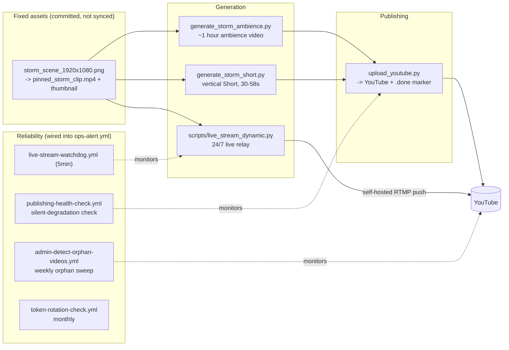

# Amber Hours -- Rain & Thunder Ambience Bot (YouTube)

Automated pipeline that turns real Pixabay storm/rain b-roll (falling
back to an original animated storm scene when none is synced) and
procedurally-synthesized rain/thunder audio into a long-form ambience
video, vertical Shorts, and a 24/7 live stream -- no narration, just
ambience -- published through the official YouTube Data API under the
**Amber Hours** brand.

This is the channel's only content pillar (growth pass, 2026-07-21): an
earlier "rainy-night anime lofi" format was retired in favor of this one
-- see "Why rain & thunder ambience" below for the reasoning, and
[docs/adr/0003-rainy-night-anime-lofi-niche.md](docs/adr/0003-rainy-night-anime-lofi-niche.md)
for the superseded lofi-era decision record.

## Why rain & thunder ambience

"Anime lofi" is one of YouTube's most saturated searches -- every title,
tag, and hashtag a small channel could try there already competes with
Lofi Girl and near-identical channels for the same narrow head terms.
`generate_storm_ambience.py` targets a different, much larger, and much
less saturated intent instead: "rain sounds for sleep", "thunderstorm
ambience" -- the searches an insomniac, a parent settling a baby, or
someone masking tinnitus actually types (see `utils/storm_branding.py`'s
module docstring for the full vocabulary reasoning).

- **Visual**: `scripts/generate_storm_scene.py` draws its own animated
  scene (overcast sky, storm clouds, heavier wind-blown rain, an
  occasional lightning flash) as a seamless loop (`utils/brand_motion.py`,
  14s so a flash doesn't repeat every few seconds) -- used as the fallback
  when no real footage is synced, and directly as the 24/7 live relay's
  one pinned visual.
- **Audio**: `utils/storm_audio.py` *synthesizes* rain and distant
  thunder procedurally (FFT-shaped periodic noise -- exactly loop-safe by
  construction, no crossfade needed) instead of looping a recorded
  sample, so there's no recording to license, clear, or run out of. No
  music layer (chat, 2026-07-22: an optional quiet Jamendo layer was
  tried and dropped -- Jamendo's catalog is music, not sound effects, so
  it never delivered rain sound). The video loop and the rain-bed loop
  have different, non-matching periods, so the combined video never
  feels like it's repeating in lockstep even though each layer loops
  individually.
- **Real footage, automatic**: `scripts/sync_storm_broll.py` downloads
  real Pixabay storm/rain b-roll (`video_type="film"`) into a rotating
  pool (`_assets/video/storm_broll/`, capped at 16), gated by a tag
  relevance check at both download and selection time
  (`utils.broll.looks_storm_relevant`/`is_on_brand_storm_clip`).
  `generate_storm_ambience.py` and `generate_storm_short.py` pick a
  random real clip from that pool first, falling back to the illustrated
  scene only when the pool is empty (no `PIXABAY_API_KEY` configured, or
  the sync hasn't run yet). Real footage doesn't loop as cleanly as the
  hand-drawn scene by construction, so a short crossfade
  (`_prepare_seamless_loop_clip`, an `xfade` bake) is baked once at the
  loop seam before the video is looped to fill the target runtime.
  `scripts/search_storm_broll_candidates.py` exists as a read-only admin
  helper for eyeballing candidates by hand.
- **Long-form**: `generate_storm_ambience.py` renders a ~1-hour ambience
  video (`STORM_MIN_DURATION_MINUTES`/`STORM_MAX_DURATION_MINUTES`,
  default 55-65) published by `storm-ambience.yml` twice a day.
- **Shorts**: `generate_storm_short.py` mirrors the long-form shape --
  the same animated scene rendered vertically (1080x1920,
  `build_storm_short_frame()`), a shorter non-matching rain-bed loop,
  30-58s runtime. Published by `storm-shorts.yml` every 2 hours.
- **Live**: the 24/7 relay (`scripts/live_stream_dynamic.py`) loops one
  pinned real clip (`_assets/video/pinned_storm_live.mp4`), mixing the
  synthesized rain bed straight to RTMP.
- **AI titling**: `utils/ai_titling.py` asks an AI provider (Gemini first,
  if `GEMINI_API_KEY` is set, via `utils/ai_helper.py`'s Cerebras/Groq/
  Mistral fallback chain) to write each video's title, description and
  hashtags, given only the scene, duration and format -- never inventing
  facts, and always instructed to ignore any instruction embedded in that
  input. Falls back to template title/description if no key is
  configured or the call fails.
- Gated by the `STORM_AMBIENCE_ENABLED` repository variable (see
  SETUP.md) -- turns both `storm-ambience.yml` and `storm-shorts.yml` on
  or off together.

## Community engagement

Opt-in via the `COMMUNITY_ENGAGEMENT_ENABLED` repository variable (see
SETUP.md), independent of `YOUTUBE_PUBLISHING_ENABLED`:

- `community-comment-replies.yml` replies to fresh top-level comments
  across the channel through the official `commentThreads`/`comments`
  API -- a local ledger, a link/spam skip, and a per-run cap keep it from
  ever double-replying or engaging with spam (`scripts/reply_to_comments.py`,
  `utils/community_replies.py`).
- `community-post-draft.yml` commits one ready-to-paste Community-tab post
  suggestion a week (`scripts/draft_community_post.py`,
  `utils/community_posts.py`). The Community tab has no public API (see
  SECURITY.md), so this is an operator-assist artifact, not automation --
  a human still pastes it into YouTube Studio.

## Pipeline

The live relay streams straight to RTMP
with `-stream_loop -1` on both the video clip and audio -- there is no
bake-to-file step, so a crash/restart is back on air within seconds. The
looped clip is preprocessed once with a short crossfade baked between
its tail and head so the loop wrap-around has no visible jump cut.

This channel was rebuilt from an earlier nature-science-facts format
(narrated Shorts, editorial scoring pipeline, trend hijacking, a story
queue), then briefly ran a "rainy-night anime lofi" format before fully
pivoting to this rain/thunder ambience pillar (growth pass, 2026-07-21) --
each prior pipeline and its exclusive scripts/docs/workflows were removed
once the channel moved on; a handful of shared modules (b-roll fetching,
upload, media lifecycle) survived every cleanup because the current
pipeline still uses them.

Basic view/watch-time analytics come from manual YouTube Studio CSV
exports via `studio-reach-import.yml` and `reporting-backfill.yml`, and
are rendered on the `dashboard.yml` status page, including a daily trend
(views, subscribers, Shorts published, title-collision rate) and a
per-playlist-bucket breakdown. Real per-video view data also feeds back
into b-roll selection weighting (`utils/broll_performance.py`) once
enough of it exists -- see that module's docstring.

## Reliability

Day-to-day operations, what to do when an alert fires, and how to
rotate the YouTube token are in [RUNBOOK.md](RUNBOOK.md).

## Required secrets

- `YOUTUBE_TOKEN` -- upload + playlist/comment operations. OAuth JSON
  token, not an API key. Generate it once with `auth_youtube.py` or the
  `Build auth_youtube.exe (Windows)` workflow. See [SETUP.md](SETUP.md).
- `YOUTUBE_STREAM_KEY` -- only needed for the 24/7 live relay
  (`live-stream.yml`).
- `PIXABAY_API_KEY` -- real storm/rain b-roll footage
  (`scripts/sync_storm_broll.py`); falls back to the illustrated pinned
  scene if missing.

No AI text provider key is required -- title/description text is
template-based unless `GEMINI_API_KEY` (or an equivalent provider key)
is configured.
