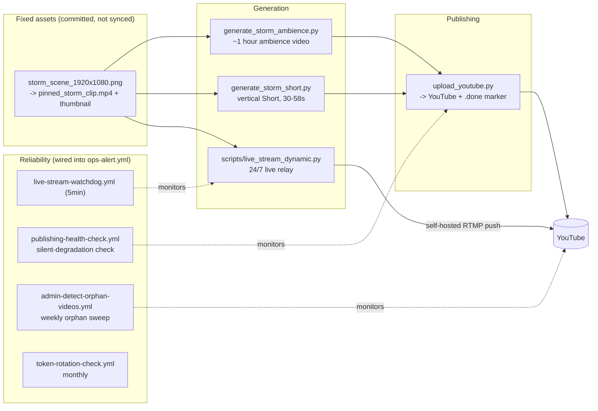

# Amber Hours -- Rain & Thunder Ambience Bot (YouTube)

Automated pipeline that turns real Pixabay storm/rain b-roll (falling
back to an original animated storm scene when none is synced) and
procedurally-synthesized rain/thunder audio into a long-form ambience
video, vertical Shorts, and a 24/7 live stream -- no narration, just
ambience -- published through the official YouTube Data API under the
**Amber Hours** brand.

This is the channel's only content pillar (growth pass, 2026-07-21): an
earlier "rainy-night anime lofi" format was retired in favor of this one
-- see "Why rain & thunder ambience" below for the reasoning, and
[docs/adr/0003-rainy-night-anime-lofi-niche.md](docs/adr/0003-rainy-night-anime-lofi-niche.md)
for the superseded lofi-era decision record.

## Why rain & thunder ambience

"Anime lofi" is one of YouTube's most saturated searches -- every title,
tag, and hashtag a small channel could try there already competes with
Lofi Girl and near-identical channels for the same narrow head terms.
`generate_storm_ambience.py` targets a different, much larger, and much
less saturated intent instead: "rain sounds for sleep", "thunderstorm
ambience" -- the searches an insomniac, a parent settling a baby, or
someone masking tinnitus actually types (see `utils/storm_branding.py`'s
module docstring for the full vocabulary reasoning).

- **Visual**: `scripts/generate_storm_scene.py` draws its own animated
  scene (overcast sky, storm clouds, heavier wind-blown rain, an
  occasional lightning flash) as a seamless loop (`utils/brand_motion.py`,
  14s so a flash doesn't repeat every few seconds) -- used as the fallback
  when no real footage is synced, and directly as the 24/7 live relay's
  one pinned visual.
- **Audio**: `utils/storm_audio.py` *synthesizes* rain and distant
  thunder procedurally (FFT-shaped periodic noise -- exactly loop-safe by
  construction, no crossfade needed) instead of looping a recorded
  sample, so there's no recording to license, clear, or run out of. No
  music layer (chat, 2026-07-22: an optional quiet Jamendo layer was
  tried and dropped -- Jamendo's catalog is music, not sound effects, so
  it never delivered rain sound). The video loop and the rain-bed loop
  have different, non-matching periods, so the combined video never
  feels like it's repeating in lockstep even though each layer loops
  individually.
- **Real footage, automatic**: `scripts/sync_storm_broll.py` downloads
  real Pixabay storm/rain b-roll (`video_type="film"`) into a rotating
  pool (`_assets/video/storm_broll/`, capped at 16), gated by a tag
  relevance check at both download and selection time
  (`utils.broll.looks_storm_relevant`/`is_on_brand_storm_clip`).
  `generate_storm_ambience.py` and `generate_storm_short.py` pick a
  random real clip from that pool first, falling back to the illustrated
  scene only when the pool is empty (no `PIXABAY_API_KEY` configured, or
  the sync hasn't run yet). Real footage doesn't loop as cleanly as the
  hand-drawn scene by construction, so a short crossfade
  (`_prepare_seamless_loop_clip`, an `xfade` bake) is baked once at the
  loop seam before the video is looped to fill the target runtime.
  `scripts/search_storm_broll_candidates.py` exists as a read-only admin
  helper for eyeballing candidates by hand.
- **Long-form**: `generate_storm_ambience.py` renders a ~1-hour ambience
  video (`STORM_MIN_DURATION_MINUTES`/`STORM_MAX_DURATION_MINUTES`,
  default 55-65) published by `storm-ambience.yml` twice a day.
- **Shorts**: `generate_storm_short.py` mirrors the long-form shape --
  the same animated scene rendered vertically (1080x1920,
  `build_storm_short_frame()`), a shorter non-matching rain-bed loop,
  30-58s runtime. Published by `storm-shorts.yml` every 2 hours.
- **Live**: the 24/7 relay (`scripts/live_stream_dynamic.py`) loops one
  pinned real clip (`_assets/video/pinned_storm_live.mp4`), mixing the
  synthesized rain bed straight to RTMP.
- **AI titling**: `utils/ai_titling.py` asks an AI provider (Gemini first,
  if `GEMINI_API_KEY` is set, via `utils/ai_helper.py`'s Cerebras/Groq/
  Mistral fallback chain) to write each video's title, description and
  hashtags, given only the scene, duration and format -- never inventing
  facts, and always instructed to ignore any instruction embedded in that
  input. Falls back to template title/description if no key is
  configured or the call fails.
- Gated by the `STORM_AMBIENCE_ENABLED` repository variable (see
  SETUP.md) -- turns both `storm-ambience.yml` and `storm-shorts.yml` on
  or off together.

## Second pillar: "Pata Jazz" cute-animal Shorts (off by default)

A second, fully independent content pillar (chat, 2026-07-22): real
Pixabay footage of cute animals (cats, dogs, puppies, kittens, bunnies,
hamsters) set to real jazz music, published as its own brand, **"Pata
Jazz"** -- deliberately not "Amber Hours". That name already means "real
rain/thunder ambience for sleep" to anyone who has seen the channel;
reusing it on playful, upbeat cute-animal content would confuse both
audiences. Same channel/account for now, its own on-screen identity.

- **Video**: `scripts/sync_animal_broll.py` keeps a rotating pool of real
  Pixabay clips (`_assets/video/animal_broll/`, capped at 24) -- the
  opposite design from the rain pillar's 3 fixed pinned clips on purpose:
  variety across many different animals is this pillar's whole appeal,
  not a single consistent scene. `generate_cute_animal_short.py` picks a
  random on-topic clip each run and extracts a real thumbnail frame from
  it directly (learned from the rain pillar's earlier illustrated-vs-real
  thumbnail mismatch -- this pillar never makes that mistake in the first
  place). No illustrated fallback exists for this pillar; if the pool is
  ever empty, the run is skipped rather than faking a placeholder.
- **Audio**: `scripts/sync_animal_jazz.py` syncs real, commercially-safe
  (CC BY only, same `_commercially_safe()` license check the rain
  pillar's abandoned Jamendo experiment used) jazz tracks from Jamendo.
  Unlike that abandoned experiment -- which tried to source *rain sound*
  from Jamendo and found the catalog is music, not sound effects -- jazz
  is an actual music genre Jamendo genuinely has, so this is a legitimate
  fit. The commercially-safe yield is thin either way (checked live,
  2026-07-22: roughly 1.5-2% of raw search results), so this library
  starts small and grows slowly over many scheduled runs, same as every
  other synced library in this repo. Falls back to silent audio (not a
  failed run) whenever the jazz pool is empty.
- **Titling**: `utils/ai_titling.py`'s `generate_animal_short_copy()` asks
  Gemini for a playful, warm pt-BR title/description/hashtags (very
  different tone from the calm/sleep-focused rain pillar), falling back
  to `utils/animal_branding.py`'s template vocabulary when no AI key is
  configured or the call fails.
- **Cadence**: deliberately conservative, NOT the "24/day, one per hour"
  originally floated. This same account already hit YouTube's own
  `uploadLimitExceeded` (account-level daily upload cap, independent of
  this repo's internal quota-guard) twice in one day at a combined ~14
  uploads/day across the rain pillar -- direct evidence the real per-day
  cap on this freshly-reset channel is low. `cute-animals-shorts.yml`
  defaults to 8/day (every 3 hours); raise it by editing that workflow's
  cron once the channel's real daily cap is confirmed higher (e.g. after
  phone-verifying the channel) or once a decision is made to pause the
  rain pillar to free up quota headroom for this one.
- Gated by its own `CUTE_ANIMALS_ENABLED` repository variable (see
  SETUP.md), independent of `STORM_AMBIENCE_ENABLED` and
  `YOUTUBE_PUBLISHING_ENABLED` -- **off by default**. Whether to run this
  alongside the rain pillar or instead of it (given the shared account
  upload cap) is the channel owner's call, not made here.

## Third pillar: white/pink/brown noise for baby sleep (off by default)

A third, independent content pillar (acting-founder growth pass,
2026-07-22, not a literal owner instruction -- see the chat log for the
reasoning): procedurally-synthesized white/pink/brown noise
(`utils/noise_audio.py`) under real, calm Pixabay nursery/night footage.
Same **Amber Hours** brand as the rain pillar (unlike "Pata Jazz"): the
promise -- real ambient sound to help you sleep, focus, or calm down --
is identical, just a different scene/audience within it. The rain
pillar's own `utils/storm_branding.py` already lists "baby sleep" and
"tinnitus" scenes, but its audio is rain/thunder texture; this pillar
delivers the plain noise-color sound those two audiences specifically
search for and expect, which rain texture doesn't actually provide.

- **Audio**: `utils/noise_audio.py` synthesizes real white (flat
  spectrum), pink (-3dB/octave), and brown (-6dB/octave) noise via the
  same exactly-periodic FFT-shaping technique `utils/storm_audio.py`
  already uses for its rain wash -- verified live against the standard
  power-law definitions (measured -0.0, -3.0, -6.0 dB/octave respectively
  across a 5-octave span), not just "it ran without crashing". No
  thunder, no droplet texture, no music layer -- plain noise-color sound
  is the actual product this audience wants.
- **Video**: `scripts/sync_noise_broll.py` keeps a rotating pool of real,
  calm Pixabay clips (`_assets/video/noise_broll/`, capped at 16) --
  nursery/night-sky/candle-glow footage, nothing bright or busy. Rotation
  here (unlike the rain pillar's 3 fixed pinned clips) is a stand-in for
  "no one was available to hand-pick specific clips tonight," not a
  deliberate design choice; convert to fixed pinned clips later the same
  way the rain pillar's owner did, if preferred. No illustrated fallback
  exists yet (same as the "Pata Jazz" pillar) -- an empty pool skips the
  run rather than faking a placeholder. Real-frame thumbnails from day
  one (learned from the rain pillar's original illustrated-vs-real
  mismatch).
- **Long-form duration**: 3-5 hours by default
  (`BABY_NOISE_MIN_DURATION_MINUTES`/`BABY_NOISE_MAX_DURATION_MINUTES`),
  deliberately short of the "8-12 hour all night" videos common in this
  niche -- see `generate_baby_noise_ambience.py`'s module docstring for
  the extrapolated compose-time math (from the rain pillar's own real
  run today) this range and its 90-minute job timeout are padded well
  above. A proven, working 3-5h video now beats an unverified 8-12h one
  that might time out; raising the range once real run logs confirm the
  actual scaling is a config edit, not a code change.
- **Titling**: `utils/ai_titling.py`'s `generate_baby_noise_copy()` asks
  Gemini for a warm, reassuring, practical pt-BR title/description/
  hashtags (a tired parent at 2am, not a hype creator) -- explicitly
  instructed to never claim a medical/developmental benefit, only that
  the sound is calming/constant. Falls back to
  `utils/baby_noise_branding.py`'s template vocabulary when no AI key is
  configured or the call fails.
- **Formats**: long-form (`generate_baby_noise_ambience.py`,
  `baby-noise-ambience.yml`, once/day) and Shorts
  (`generate_baby_noise_short.py`, `baby-noise-shorts.yml`, every 4
  hours) -- no live relay for this pillar (the channel already runs one
  24/7 live for rain; adding a second is a separate resourcing decision,
  not built unprompted here).
- Gated by its own `BABY_NOISE_ENABLED` repository variable (see
  SETUP.md), independent of `STORM_AMBIENCE_ENABLED`/
  `CUTE_ANIMALS_ENABLED`/`YOUTUBE_PUBLISHING_ENABLED` -- **off by
  default**.

## Fourth pillar: "Amber Hours Classical" (off by default)

A fourth, independent content pillar (chat, 2026-07-22): real, licensed
classical/orchestral/piano recordings from Jamendo, one real track per
video (not a mixed bed, not a music layer under something else -- the
licensed track *is* the whole point here), looping under one fixed,
hand-picked real Pixabay clip (an anime-style "studying at a rainy
window" scene, `_assets/video/pinned_classical_ambience.mp4`, chosen by
the channel owner after reviewing real preview frames of several
candidates). The only pillar on this channel published in **English**
rather than pt-BR -- the channel owner was explicit about this.

- **Why classical**: checked live across many genres the same night --
  `fuzzytags=classical+orchestral+piano` returned ~18.5-19%
  commercially-safe (CC BY) results out of 200 raw, by far the best of
  everything tried (jazz ~1.5-2%, folk ~9%, electronic ~8.5%, everything
  else lower). The matches are genuinely on-genre real classical
  recordings (e.g. Kimiko Ishizaka's Open Goldberg Variations), not
  mistagged filler.
- **Video**: the one fixed pinned clip, no rotation, no illustrated
  fallback (none exists for this pillar -- if it's ever missing, the
  generator exits with a clear error rather than faking a placeholder).
  A real thumbnail frame was extracted from it once and committed
  (`_assets/branding/classical_ambience_thumbnail.jpg`) -- this pillar
  never had the illustrated-vs-real thumbnail mismatch the rain pillar
  had to fix retroactively, because there was never an illustration to
  begin with.
- **Audio**: `scripts/sync_classical_music.py` syncs real CC BY classical
  tracks toward a ~150-track target (the channel owner's explicit ask,
  for the live's rotation) -- see that script's module docstring for the
  realistic ramp-up math given the measured yield. `generate_classical_
  ambience.py` picks the least-recently-used track (mtime-based
  round-robin, not pure random -- meaningful at an hourly cadence) and
  renders a video whose *exact* duration is that track's own real length
  -- the pinned clip loops to fill it, the track itself plays once,
  start to finish.
- **Mandatory attribution**: every video's description ends with an
  exact, unconditional credit line -- real track name, real artist name,
  real CC BY license URL -- appended in code after either the AI-written
  or template description, every single time. This is a legal
  requirement of the CC BY license, not a stylistic choice the AI is
  free to paraphrase away.
- **No Shorts companion** for this pillar -- long-form only, at roughly
  hourly cadence (`classical-ambience.yml`, ~24/day) explicitly taking
  the role Shorts would have played. The channel owner chose this
  cadence aware that the account hit `uploadLimitExceeded` around
  ~23-24/day when multiple pillars were stacked earlier -- since every
  other pillar is currently disabled, this one running alone at ~24/day
  is an informed choice, not an oversight.
- **Live**: `scripts/live_stream_classical.py` is its own dedicated 24/7
  relay (not a branch added to `scripts/live_stream_dynamic.py`, which
  stays rain-only) -- the same pinned clip loops under a real, shuffled,
  concatenated playlist of every currently-synced classical track (same
  technique the old, removed lofi live pillar used for its bgm
  playlist). Needs its **own** stream key (`YOUTUBE_STREAM_KEY_CLASSICAL`
  -- create a second persistent live stream in YouTube Studio, Go Live ->
  Stream) -- reusing the rain pillar's `YOUTUBE_STREAM_KEY` would make
  both relays fight over the same RTMP ingestion point the moment both
  are ever enabled together. Gated by its own `live-stream-classical-
  watchdog.yml`, same 5-minute self-healing pattern as the rain pillar's
  watchdog.
- Gated by two independent repository variables (see SETUP.md):
  `CLASSICAL_AMBIENCE_ENABLED` (long-form uploads) and
  `CLASSICAL_LIVE_ENABLED` (the live relay) -- **both off by default**.
  The channel owner asked to build this pillar completely before turning
  anything on ("build first, publish after").

### Which pillars can run together?

All four content pillars share one YouTube account-level daily upload
cap that this repo's own internal quota-guard does not control or know
the real value of. This account hit `uploadLimitExceeded` twice in one
day at a combined ~14 uploads/day across the rain pillar alone. Each
pillar's *own* cadence was chosen in isolation (rain: 2 long-form + 12
Shorts/day; Pata Jazz: 8 Shorts/day; baby noise: 1 long-form + 6
Shorts/day; classical: ~24 long-form/day), but running all four
simultaneously at full designed cadence would be roughly
14 + 8 + 7 + 24 = 53 uploads/day -- almost certainly over whatever the
account's real cap turns out to be. This isn't a bug to fix in code;
it's a real decision the channel owner needs to make: which pillar(s) to
actually run together given the shared ceiling, possibly after
phone-verifying the channel (which usually raises the cap) to see how
much headroom that actually buys. Classical's ~24/day cadence in
particular was chosen specifically *because* every other pillar is
currently disabled -- it was not designed to be layered on top of the
other three at their own full cadence.

## Community engagement

Opt-in via the `COMMUNITY_ENGAGEMENT_ENABLED` repository variable (see
SETUP.md), independent of `YOUTUBE_PUBLISHING_ENABLED`:

- `community-comment-replies.yml` replies to fresh top-level comments
  across the channel through the official `commentThreads`/`comments`
  API -- a local ledger, a link/spam skip, and a per-run cap keep it from
  ever double-replying or engaging with spam (`scripts/reply_to_comments.py`,
  `utils/community_replies.py`).
- `community-post-draft.yml` commits one ready-to-paste Community-tab post
  suggestion a week (`scripts/draft_community_post.py`,
  `utils/community_posts.py`). The Community tab has no public API (see
  SECURITY.md), so this is an operator-assist artifact, not automation --
  a human still pastes it into YouTube Studio.

## Pipeline

The live relay streams straight to RTMP
with `-stream_loop -1` on both the video clip and audio -- there is no
bake-to-file step, so a crash/restart is back on air within seconds. The
looped clip is preprocessed once with a short crossfade baked between
its tail and head so the loop wrap-around has no visible jump cut.

This channel was rebuilt from an earlier nature-science-facts format
(narrated Shorts, editorial scoring pipeline, trend hijacking, a story
queue), then briefly ran a "rainy-night anime lofi" format before fully
pivoting to this rain/thunder ambience pillar (growth pass, 2026-07-21) --
each prior pipeline and its exclusive scripts/docs/workflows were removed
once the channel moved on; a handful of shared modules (b-roll fetching,
upload, media lifecycle) survived every cleanup because the current
pipeline still uses them.

Basic view/watch-time analytics come from manual YouTube Studio CSV
exports via `studio-reach-import.yml` and `reporting-backfill.yml`, and
are rendered on the `dashboard.yml` status page, including a daily trend
(views, subscribers, Shorts published, title-collision rate) and a
per-playlist-bucket breakdown. Real per-video view data also feeds back
into b-roll selection weighting (`utils/broll_performance.py`) once
enough of it exists -- see that module's docstring.

## Reliability

Day-to-day operations, what to do when an alert fires, and how to
rotate the YouTube token are in [RUNBOOK.md](RUNBOOK.md).

## Required secrets

- `YOUTUBE_TOKEN` -- upload + playlist/comment operations. OAuth JSON
  token, not an API key. Generate it once with `auth_youtube.py` or the
  `Build auth_youtube.exe (Windows)` workflow. See [SETUP.md](SETUP.md).
- `YOUTUBE_STREAM_KEY` -- only needed for the 24/7 live relay
  (`live-stream.yml`).
- `PIXABAY_API_KEY` -- real storm/rain b-roll footage
  (`scripts/sync_storm_broll.py`); falls back to the illustrated pinned
  scene if missing.

No AI text provider key is required -- title/description text is
template-based unless `GEMINI_API_KEY` (or an equivalent provider key)
is configured.
