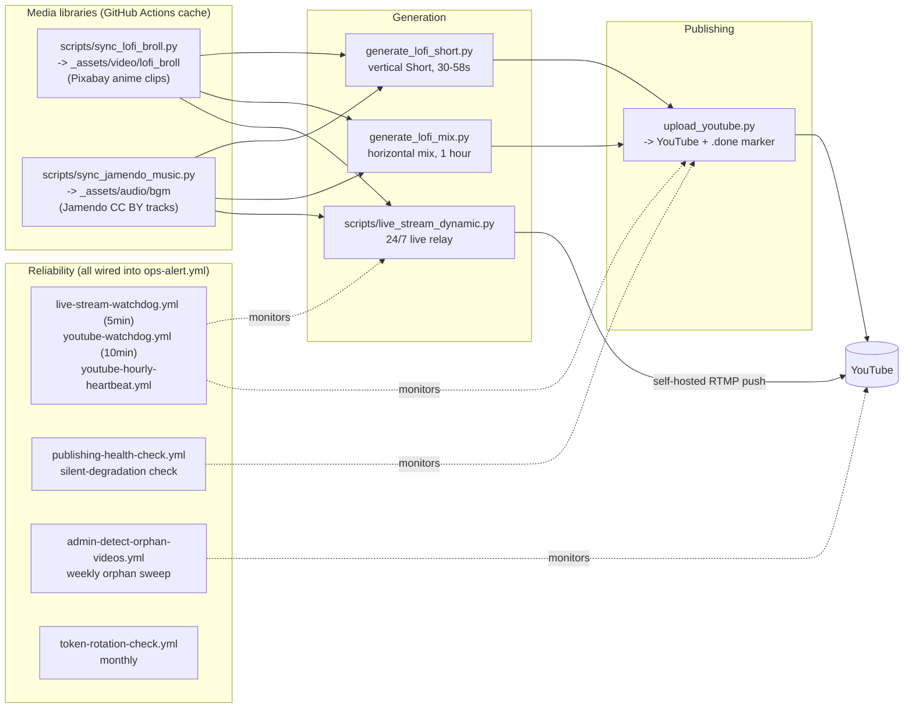

# Amber Hours -- Lofi Beats Bot (YouTube)

Automated pipeline that turns free-licensed Pixabay anime/illustrated
b-roll (the "Lofi Girl" studying-loop look) and Creative Commons (CC BY,
commercial-safe) music into looping lofi YouTube Shorts, a daily 1-hour
horizontal mix, and a 24/7 lofi live stream -- no narration, clip + music
only -- published through the official YouTube Data API under the
**Amber Hours** brand.

- Cadence: `youtube-bot.yml` (Shorts) fires up to 3x/hour (`:02`, `:22`,
  `:42`, the extra two as a recovery net for delayed/dropped GitHub
  schedule events); `lofi-mix-daily.yml` fires once a day. Both use
  `upload_youtube.py`'s per-canonical-slot dedup, so a slot never
  publishes twice.
- Duration: Shorts are **30-58 seconds**, randomized. The horizontal mix
  is a short **3-song** mix (duration = the sum of the 3 tracks), published
  every 30 minutes.
- Category: YouTube **Music** (`categoryId=10`) for both formats.
- Content: each format (Shorts, mix, 24/7 live) loops one fixed, committed
  visual (`_assets/video/pinned_*`) under Jamendo CC BY-licensed music,
  with a branded title/description/thumbnail. The pinned visuals are
  procedurally generated in-repo with ffmpeg (`gradients`/`geq`/`overlay`
  -- an animated gradient, a soft glow, film grain and a vignette; see each
  `pinned_*.json` sidecar), not sourced from a stock library -- earlier
  revisions used Pixabay anime-style b-roll (`video_type=animation`) for
  this; Pexels was tried before that but has no genuine illustrated
  content -- checked live, its "anime" search results are cosplay footage
  and mistagged live-action.

## Sub-niche: rainy-night anime lofi

A small channel can't win a broad "lofi" or "chillhop" search -- Lofi
Girl and similar giants already own those head terms. Every title,
tag, and hashtag instead leans into a specific identity: **rainy-night,
cozy anime lofi**. `utils/lofi_branding.py` is the shared vocabulary
(`branded_title()`, mood -> hook/emoji, playlist bucketing) both
generators and the retroactive rebrand scripts pull from, so a viewer
sees one consistent "Amber Hours" identity across every format. See that
module's docstring for the full reasoning.

## Pipeline

The b-roll/bgm libraries (`_assets/video/lofi_broll`, `_assets/audio/bgm`)
are gitignored and persist across ephemeral runners via GitHub Actions
cache (`actions/cache`, key `lofi-media-*`) instead of git, so the Jamendo
library grows toward its ~150-track target over many runs instead of
resetting to empty every time. The live relay streams straight to RTMP
with `-stream_loop -1` on both the video clip and the audio playlist --
there is no bake-to-file step, so a crash/restart is back on air within
seconds regardless of playlist size. The looped clip is preprocessed once
with a short crossfade baked between its tail and head so the loop
wrap-around has no visible jump cut. The live relay's pinned visual
rotates weekly across a small curated pool (`_assets/video/pinned_live_clips/`)
instead of looping one clip forever.

This channel was rebuilt from an earlier nature-science-facts format
(narrated Shorts, editorial scoring pipeline, trend hijacking, a story
queue). That pipeline and its supporting scripts/docs have been removed
now that the channel has fully moved to the lofi format; a handful of
shared modules (b-roll fetching, upload, media lifecycle) survived the
cleanup because the lofi pipeline still uses them.

Basic view/watch-time analytics come from manual YouTube Studio CSV
exports via `studio-reach-import.yml` and `reporting-backfill.yml`, and
are rendered on the `dashboard.yml` status page, including a daily trend
(views, subscribers, Shorts published, title-collision rate) and a
per-mood-bucket breakdown. Real per-video view data also feeds back into
b-roll selection weighting (`utils/broll_performance.py`) once enough of
it exists -- see that module's docstring.

## Reliability

Day-to-day operations, what to do when an alert fires, and how to
rotate the YouTube token are in [RUNBOOK.md](RUNBOOK.md).

## Required secrets

- `YOUTUBE_TOKEN` -- Shorts/mix upload + playlist/comment operations.
  OAuth JSON token, not an API key. Generate it once with
  `auth_youtube.py` or the `Build auth_youtube.exe (Windows)` workflow.
  See [SETUP.md](SETUP.md).
- `PIXABAY_API_KEY` -- anime/illustrated b-roll for Shorts, the mix, and
  the live loop.
- `YOUTUBE_STREAM_KEY` -- only needed for the 24/7 live relay
  (`live-stream.yml`).

Jamendo music sync (`scripts/sync_jamendo_music.py`) uses a registered
Jamendo client id (`CLIENT_ID` in that script) and needs no separate
GitHub secret. No AI text provider key is required by the active lofi
pipeline -- title/description text is template-based, not AI-generated.
