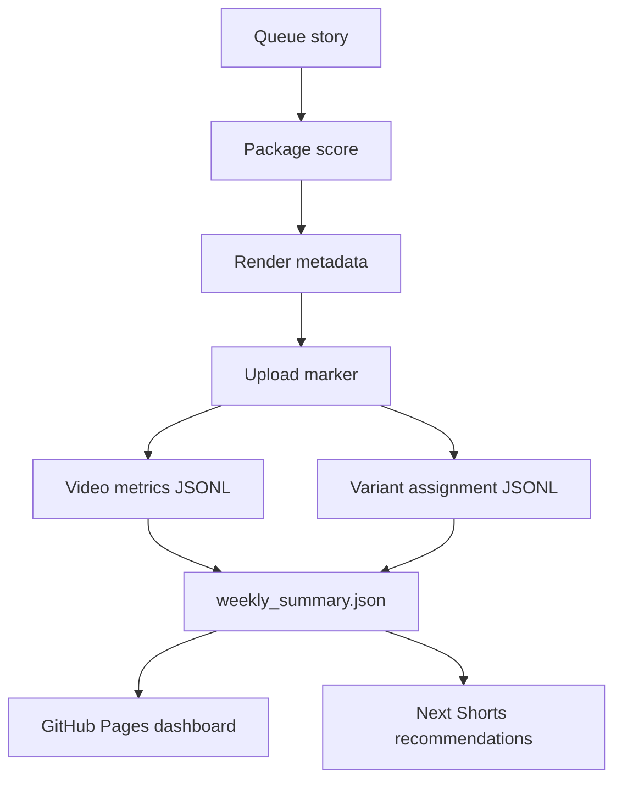

# Wild Brief World-Class Upgrade

## Executive Summary

Wild Brief is no longer just an upload bot. It is a zero-cost YouTube Shorts
growth system with queue building, vertical rendering, TTS, captions, official
YouTube upload, analytics feedback, dashboard publishing and editorial learning.
The next lift is not more automation for its own sake. The lift is better
decision quality before render and better learning after upload.

This upgrade preserves every current provider and API. It now adds a central
package rulebook, normalized analytics schemas, safer baseline artifacts and a
production path toward stronger retention, replay, session growth and subscriber
conversion.

## Priority Code Changes

| Priority | File | Function or class | Inputs | Outputs | Why it matters |
| --- | --- | --- | --- | --- | --- |
| P0 | `utils/editorial_rules.py` | `EditorialRulebook.evaluate` | story, package, context | approval, score, violations, format, duration | Creates one central pre-render scorecard for hook, first frame, payoff, loop and freshness. |
| P0 | `utils/analytics_schema.py` | `build_video_metric_row` | video id, title, metrics, context | normalized JSON row | Gives future jobs stable fields and derived metrics. |
| P0 | `utils/analytics_schema.py` | `build_variant_row` | axis, variant, story id, video id | assignment row | Makes experiment logging explicit and durable. |
| P0 | `scripts/bootstrap_growth_baseline.py` | `build_baseline` | repo root | JSONL files and weekly summary | Creates empty-state-safe baseline analytics artifacts. |
| P1 | `generate_shorts.py` | package preflight and loop render integration | selected story/package | metadata with rulebook, loop score and rendered loop line | Stops weak packages before expensive render work and makes replay callbacks visible in the final Short. |
| P1 | `scripts/build_dashboard.py` | dashboard sections | weekly summary and package scores | Pages sections | Shows what to publish, pause, sequel and review. |

## Implementation Status

Implemented:

- FASE 1 baseline schemas, rulebook and bootstrap artifacts.
- FASE 2 `CuriosityGapEngine` and `SwipeRiskScore`.
- FASE 3 `LoopGenerator`, metadata persistence and rendered final-line loop
  callbacks through `package_story` and `generate_shorts.py`.
- FASE 4 expanded experiment axes, including `end_card_style`, live
  assignment logging and `BayesianABSelector`.
- FASE 5 `collect_analytics_extended.py`, normalized warehouse files and
  `weekly_growth_review.py`.
- FASE 6 `free_signal_harvester.py`, `trend_bridge.py` and
  `post_upload_session_ops.py`.
- FASE 7 structured observability helpers, integrated optional TTS fallback,
  environment docs, security updates, dashboard sections, dashboard smoke in CI
  and scoped CI linting.
- Adaptive cadence hardening: `utils/publish_schedule.py` is the canonical
  source for the 24/day UTC evaluation grid `00:00`, `01:00`, `02:00`,
  `03:00`, `04:00`, `05:00`, `06:00`, `07:00`, `08:00`, `09:00`,
  `10:00`, `11:00`, `12:00`, `13:00`, `14:00`, `15:00`, `16:00`,
  `17:00`, `18:00`, `19:00`, `20:00`, `21:00`, `22:00` and `23:00`;
  `scripts/publish_window.py` writes `_data/publish_slot_decisions.jsonl` and
  can safely skip slots with low queue quality or no eligible story.
- Temporal contract v2: `utils/time_semantics.py` writes `publish_ts_utc`,
  `publish_day_pt`, `quota_day_pt` and `views_regime`, while
  `scripts/audit_slot_contracts.py` checks parity between workflows, docs and
  the canonical schedule.
- Shorts leading indicators: `scripts/import_studio_reach_export.py` and
  `utils/studio_reach_schema.py` normalize Studio/Sheets CSV exports into
  `_data/analytics/studio_reach_daily.jsonl` and dashboard cards for
  stayed-to-watch and swipe-away risk.
- Freshness bridge v2: free signal imports now carry signal counts and
  freshness metadata; `scripts/apply_topic_freshness.py` annotates the queue
  and writes `_data/trends/freshness_report.json`.
- Opening quality: `utils/first_frame_audit.py` is integrated into the
  editorial rulebook, generation metadata and `_data/opening_audit_report.json`.
- Opening hard gate v2: `utils/opening_gate_v2.py` scores 0.7s and 1.5s
  windows with motion, contrast, legibility, curiosity and first-word timing.
- Hook/story/payoff/loop controls: `utils/hook_library.py`,
  `utils/story_patterns.py`, `utils/payoff_controller.py` and
  `utils/loop_semantics.py` persist cluster, payoff second, loop density and
  callback overlap metadata.
- Claim, rights and originality guards: `utils/claim_risk.py`,
  `utils/rights_guard.py` and `utils/originality_pack.py` feed
  `_data/fact_sources.jsonl`, `_data/source_provenance.jsonl` and
  `_data/originality_pack.jsonl`.
- Experiment governance v2: `utils/experiment_registry.py` and
  `utils/experiment_scheduler.py` write `_data/experiment_registry.json` and
  `_data/underpowered_tests.json` so low-volume testing stays one creative
  axis at a time.
- Upload idempotency: `scripts/upload_intent.py` records
  `_data/upload_intents.jsonl` before and after `videos.insert`.
- Session graph and sequel ops: `utils/session_graph.py` feeds
  `_data/session_graph.json`, `_data/next_session_actions.json`,
  `_data/sequel_candidates.json`, pinned-comment copy and sequence planning.
- Operations guardrails: `utils/api_quota_budget.py`, `scripts/quota_preflight.py`,
  the workflow summaries and dashboard surface quota spend before expensive runs.
- Statistical experiments and mix: `utils/ab_selector.py` has guardrails for
  samples, days and engaged views; `utils/editorial_mix_optimizer.py` keeps the
  next-shorts mix balanced across trend, evergreen, sequel and recovery lanes.
- Medium/low-priority hardening: Reporting CSV bootstrap/pull, safe
  music-bed variants, comment-to-Short triage, operator cockpit dashboard cards,
  analytics compaction, reusable CI checks, SEO metadata lint, golden fixtures,
  a central feature-flag registry, TTS healthcheck, architecture/runbooks and
  repo contract drift detection are all wired with rollback flags.

## Pipeline Diagram

## Data Flow Diagram

## FASE 1 - Baseline, Schemas, Consolidation

Implemented now:

- `utils/editorial_rules.py`
  - `EditorialRulebook`
  - `evaluate_story_package(story, package, context=None)`
  - Scores visual immediacy, hook specificity, script concreteness, payoff
    timing, loop potential, CTA burden, duplicate-angle risk and freshness.
- `utils/analytics_schema.py`
  - `build_video_metric_row`
  - `build_variant_row`
  - `build_retention_row`
  - `build_trend_signal_row`
  - `write_jsonl_row`
  - `read_jsonl`
  - `validate_row`
- `scripts/bootstrap_growth_baseline.py`
  - Reads `_data/analytics/latest.json` when present.
  - Writes `_data/analytics/video_metrics.jsonl`.
  - Writes `_data/analytics/variant_assignments.jsonl`.
  - Writes `_data/analytics/weekly_summary.json`.
  - Runs safely with missing historical files.

Acceptance tests:

- Empty analytics directory does not crash.
- Created JSON and JSONL files are valid.
- Derived metrics avoid division by zero.
- Weak package shapes are penalized.

## FASE 2 - Curiosity Gap and Swipe Defense

Implemented files:

- `utils/curiosity_gap.py`
  - `HookCandidate`
  - `CuriosityGapEngine.build_candidates`
  - `CuriosityGapEngine.score_candidate`
  - `CuriosityGapEngine.choose_best`
- `utils/swipe_risk.py`
  - `SwipeRiskScore.score_opening`
  - `SwipeRiskScore.explain`

Acceptance tests:

- Concrete hooks beat generic hooks.
- High-motion short-copy openings score lower risk than abstract openings.
- Recent duplicate hooks receive a penalty.

## FASE 3 - Loop and Rewatch Engine

Implemented file:

- `utils/loop_engine.py`
  - `LoopGenerator.plan`
  - `LoopGenerator.build_outro_to_intro_bridge`
  - `LoopGenerator.apply_render_hints`

Rules:

- Last line should call back to the opening image or question.
- Last subtitle should carry one keyword from the first subtitle.
- Avoid dead-stop endings and explicit replay begging.
- Use subtle audio tail guidance only where rendering supports it.
- `generate_shorts.py` applies the loop-plan final line to the script before
  TTS and caption generation and records `loop_render_applied` in metadata.

Acceptance tests:

- A valid loop dict is always returned.
- Final line stays inside the duration budget.
- Loop score rises when opening and ending share callback structure.

## FASE 4 - A/B Learning and Auto-Selection

Extend `utils/experiments.py`; do not replace it.

Recommended axes:

- `hook_style`: `outcome_first`, `mechanism_gap`, `question`, `time_pressure`
- `opening_visual_pattern`: `animal_closeup`, `action_first`, `before_after`, `impossible_result`
- `subtitle_density`: `low`, `medium`
- `loop_style`: `callback`, `unfinished_mechanism`, `mirror_opening`
- `cta_pattern`: `question_tease`, `sequel_tease`, `identity_follow`
- `title_shape`: `curiosity_gap`, `mechanism_reveal`, `impossible_fact`
- `end_card_style`: `subscribe_clean`, `loop_callback`, `series_tease`

Implemented files:

- `utils/ab_selector.py`
  - `BayesianABSelector.score_variant`
  - `BayesianABSelector.choose_live_variant`
  - `BayesianABSelector.has_enough_data`
- `utils/experiments.py`
  - `assign_all_for_production`
  - `record_variant_assignments`
- `generate_shorts.py`
  - records assignments into `_data/analytics/variant_assignments.jsonl`
  - renders experiment-aware end card text.

Stopping rules:

- Keep a permanent exploration slice, default 15 percent.
- Require a minimum sample size and multiple publish days before crowning a
  winner.
- Do not overfit to one outlier.

## FASE 5 - Analytics Augmentation and Weekly Decision Job

Implemented files:

- `scripts/collect_analytics_extended.py`
- `scripts/weekly_growth_review.py`

Metrics:

- views
- engaged views
- estimated minutes watched
- average view duration
- average view percentage
- likes
- comments
- shares
- subscribers gained
- traffic source type and safe detail when available
- publish slot, weekday, series, format, category and variants

Derived metrics:

- `engaged_view_rate = engaged_views / max(views, 1)`
- `replay_rate_proxy = max(views - engaged_views, 0) / max(engaged_views, 1)`
- `sub_per_1k_engaged = 1000 * subscribers_gained / max(engaged_views, 1)`
- `comment_rate_per_1k_engaged = 1000 * comments / max(engaged_views, 1)`
- `minutes_per_engaged_view = estimated_minutes_watched * 60 / max(engaged_views, 1)`
- `source_diversity = normalized traffic-source entropy`

Output:

- `_data/analytics/weekly_summary.json`
- `_data/analytics/video_metrics.jsonl`
- `_data/analytics/video_core_daily.jsonl`
- `_data/analytics/traffic_source_daily.jsonl`
- `_data/analytics/retention_curve.jsonl`
- `_data/analytics/segment_metrics.jsonl`
- `_data/analytics/extended_collection_report.json`
- `_data/reports/weekly-growth-YYYY-MM-DD.md`
- `_data/next_shorts.json`
- `_data/experiments_recommendations.json`
- missing API reports are recorded instead of failing the job when an OAuth
  token does not expose optional analytics dimensions.

## FASE 6 - Free Signal Ingestion and Session Expansion

Implemented files:

- `scripts/free_signal_harvester.py`
- `utils/trend_bridge.py`
- `scripts/post_upload_session_ops.py`

Safe signal rules:

- Prefer official exports, manual CSV drops and curated RSS sources.
- Cache all external pulls.
- Add timeouts and retries.
- Do not use private or unsupported YouTube endpoints.
- If an action is not officially automatable, generate an operator-assist
  artifact instead.

Session outputs:

- `_data/post_upload_session_ops.json`
- `_data/related_video_recommendations.json`
- `_data/comment_reply_short_candidates.json`
- `_data/session_graph.json`
- `_data/next_session_actions.json`
- `_data/sequel_candidates.json`

## FASE 8 - Leading Indicators, Quota and Operator Cockpit

Implemented files:

- `scripts/import_studio_reach_export.py`
- `scripts/apply_topic_freshness.py`
- `scripts/opening_audit_report.py`
- `scripts/quota_preflight.py`
- `scripts/reporting_bootstrap.py`
- `scripts/reporting_pull.py`
- `scripts/comment_to_short_pipeline.py`
- `scripts/compact_analytics.py`
- `scripts/seo_metadata_lint.py`
- `scripts/check_repo_contracts.py`
- `scripts/tts_healthcheck.py`
- `utils/studio_reach_schema.py`
- `utils/topic_freshness.py`
- `utils/first_frame_audit.py`
- `utils/session_graph.py`
- `utils/api_quota_budget.py`
- `utils/editorial_mix_optimizer.py`
- `utils/comment_to_short.py`
- `utils/feature_flags.py`

Operator outputs:

- `_data/analytics/studio_reach_daily.jsonl`
- `_data/analytics/studio_reach_latest.json`
- `_data/trends/freshness_report.json`
- `_data/opening_audit_report.json`
- `_data/analytics/api_quota_ledger.jsonl`
- `_data/analytics/api_quota_latest.json`
- `_data/fact_guard_report.json`
- `_data/fact_sources.jsonl`
- `_data/source_provenance.jsonl`
- `_data/originality_pack.jsonl`
- `_data/experiment_registry.json`
- `_data/underpowered_tests.json`
- `_data/upload_intents.jsonl`
- `_data/music_bed_report.json`
- `_data/comment_to_short_candidates.json`
- `_data/analytics/reporting_video_metrics.jsonl`
- `_data/analytics/compaction_report.json`
- `_data/seo_metadata_lint.json`

Rollback flags:

- `STUDIO_REACH_IMPORT_ENABLED=0`
- `TOPIC_FRESHNESS_ENABLED=0`
- `OPENING_AUDIT_STRICT=0`
- `SESSION_GRAPH_ENABLED=0`
- `QUOTA_GUARD_ENABLED=0`
- `YOUTUBE_REPORTING_ENABLED=0`
- `MUSIC_BED_ENABLED=0`
- `COMMENT_TO_SHORT_ENABLED=0`
- `WAREHOUSE_COMPACTION_ENABLED=0`
- `SEO_METADATA_LINT_STRICT=0`

## FASE 7 - CI/CD, Dashboard UX, Observability, Security

CI/CD:

- Keep compile, parse, pytest, dependency audit and Bandit.
- Add `ruff check` and `black --check` only after the current tree is made
  compatible or the scope is tightly configured.
- Dashboard smoke build runs in the production quality gate.
- Failure diagnostics upload `_data`, analytics JSON/JSONL, reports and
  `_site/index.html` when the quality gate fails.
- `scripts/check_schedule_sync.py` keeps README/docs/workflow/env aligned with
  the canonical publish schedule and adaptive cadence flags.

Dashboard:

- Winners this week.
- Top hook patterns.
- Swipe risk alerts.
- Loop winners.
- Related video suggestions.
- Reply-with-a-Short candidates.
- Experiment scoreboard.
- Downloadable JSON/CSV links when files exist.

Observability:

- Implemented `utils/observability.py`
  - `get_logger`
  - `emit_event`
  - `append_csv_metric`
  - `append_jsonl_metric`
  - `maybe_send_gmail_alert`

Gmail alerts must be explicitly enabled, short and secret-free.

## Editorial Rules

Hook templates:

- `This [subject] does [specific visible action].`
- `Why does this [subject] [specific behavior] right before [outcome]?`
- `[Number] seconds before [outcome], this [subject] changes [visible trait].`
- `What looks like [simple visual] is actually [counterintuitive mechanism].`

Micro-story timing:

- 0.0-1.2s: immediate visual plus hook.
- 1.2-4.0s: what is happening.
- 4.0-8.5s: why it matters or escalation.
- 8.5-15.0s: reveal, mechanism or surprise.
- 15.0-24.0s: payoff or second surprise.
- 24.0-end: loop line and one low-friction CTA when useful.

Packaging:

- First-frame text target: 2-4 words.
- First-frame text hard cap: 5 words.
- First spoken sentence target: 8-11 words.
- Title, first-frame text and narration should not repeat the same phrase.
- Use one CTA only.

## Free Tools Comparison

| Area | Option | Cost | Recommendation | Integration point |
| --- | --- | --- | --- | --- |
| TTS | existing edge-tts path | free | keep primary | `generate_shorts.py` |
| TTS fallback | Coqui local models | free | optional only | `utils/tts_fallback.py` and `generate_shorts.py` |
| Music | no external music source | free | disabled; narration stays primary | `utils/music_bed.py` |
| Trends | Google Trends official exports | free | support manual cached snapshots | `scripts/free_signal_harvester.py` |
| Discovery validation | YouTube Data API low-cost calls | free quota | use carefully | analytics scripts |
| Freshness | curated RSS sources | free | add as optional signal | `utils/trend_bridge.py` |

## Security Checklist

- Maintain a strict environment-variable inventory.
- Mark secrets required vs optional.
- Never print tokens or OAuth payloads.
- Redact suspected secrets in logs.
- Do not commit generated credentials.
- Keep local tokens, temp renders and audio caches ignored.
- Review workflow logs after auth or upload changes.
- Keep large secret handling out of source unless encrypted and justified.

## Prioritized Task List

| Priority | Task | Effort | Dependencies |
| --- | --- | --- | --- |
| P0 | Add editorial rulebook and baseline analytics schema | Done | none |
| P0 | Add curiosity gap and swipe risk package preflight | Done | baseline schema |
| P0 | Extend experiments and variant logging | Done | baseline schema |
| P1 | Add loop engine and metadata persistence | Done | generation integration |
| P1 | Add weekly growth review | Done | analytics normalization |
| P1 | Add free signal harvester | Done | analytics schema |
| P1 | Improve dashboard with winners, risks and session suggestions | Done | weekly outputs |
| P2 | Add Coqui fallback | Done | optional local dependency handling |
| P2 | Add Gmail alerts | Done | observability module |
| P2 | Harden CI with format and lint gates | Done | tests in place |

## Final 10/10 Validation Checklist

These are internal operating targets, not official platform benchmarks.

- 20-35s Shorts median average view percentage is at least 78 percent.
- Top quartile Shorts average view percentage is at least 88 percent.
- Median replay proxy is at least 0.10.
- Median engaged view rate is at least 0.78.
- Subscribers gained per 1,000 engaged views is at least 1.5.
- Comment rate per 1,000 engaged views is at least 4.
- At least 3 stable winning hook/package patterns identified.
- At least 2 losing patterns explicitly paused.
- Traffic source mix is not overconcentrated only in Shorts.
- Dashboard updates automatically.
- Weekly review runs automatically.
- CI blocks broken parsing, tests and high-severity security findings.
- No secrets exposed in logs.
- Operator can see what to publish next.
- Operator can see what to stop publishing.
- Operator can see what to sequel.
- Operator can see what related video to set.
- Operator can see what comment should become a reply Short concept.
